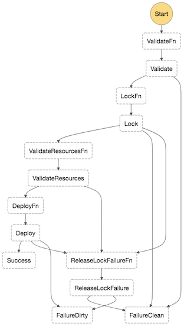

# Step Deployer



The Step Deployer is an [AWS Step Function](https://docs.aws.amazon.com/step-functions/latest/dg/getting-started.html) that can deploy step functions, so it can recursively deploy itself.

To create the necessary AWS resources you can use GeoEngineer which requires `ruby` and `terraform`:

```bash
bundle install
./scripts/geo apply resources/step_deployer.rb
```

```bash
# Use AWS Creds or assume-role
./scripts/bootstrap
```

To update the deployer you can use:

```bash
git pull # pull down new code
./scripts/deploy_deployer # recursive deployer
```

To use the deployer:

```bash
step deploy -lambda <lambda name> \
            -step <step-fn-name>  \
            -states <state machine json>
```

This will default the AWS region and account to those in the environment variables, the project and config names to tags on the lambda, the lambda file to `./lambda.zip`.

### Implementation

The tasks of the deployer are:

1. **Validate**: Validate the sent release bundle
2. **Lock**: grab a lock in S3 so others cannot deploy at the same time
3. **ValiadteResources**: Validate the referenced resources exist and have the correct tags and paths
4. **Deploy**: Update the State Machine and Lambda, then release the Lock
5. **ReleaseLockFailure**: If something goes wrong, try release the lock and fail

The end states are:

1. **Success**: deployed correctly
2. **FailureClean**: something went wrong but it has recovered the previous good state
3. **FailureDirty**: something went wrong and it is not in a good state. The existing step function, Lambda and/or lock require manual cleanup

The limitations are:

1. **State machine size** must be less than 30Kb as it is sent as part of the step-function input.
2. **Lambda size** must be less than the RAM available to the `step-deployer` lambda as it validates the lambda SHA256 in memory

### Security

Deployers are critical pieces of infrastructure as they may be used to compromise software they deploy. As such, we take security very seriously around the `step-deployer` and answer the following questions:

1. *Authentication*: Who can deploy?
2. *Authorization*: What can be deployed?
3. *Replay* and *Man-in-the-middle (MITM)*: Can some unauthorized person edit or reuse a release to change what is deployed?
4. *Audit*: Who has done what, and when?

#### Authentication

The central authentication mechanisms are the AWS IAM permissions for step functions, lambda, and S3.

By limiting the `lambda:UpdateFunctionCode`, `lambda:UpdateFunctionConfiguration`, `lambda:Invoke*` and `states:UpdateStateMachine` permissions the `step-deployer` function becomes the only way to deploy. Once this is the case, limiting permissions to `states:StartExecution` of the `step-deployer` directly limits who can deploy.

Ensuring the `step-deployer` Lambdas role can only access a single single S3 bucket with:

```
{
  "Effect": "Allow",
  "Action": [
    "s3:GetObject*", "s3:PutObject*",
    "s3:List*", "s3:DeleteObject*"
  ],
  "Resource": [
    "arn:aws:s3:::#{s3_bucket_name}/*",
    "arn:aws:s3:::#{s3_bucket_name}"
  ]
},
{
  "Effect": "Deny",
  "Action": ["s3:*"],
  "NotResource": [
    "arn:aws:s3:::#{s3_bucket_name}/*",
    "arn:aws:s3:::#{s3_bucket_name}"
  ]
},
```

Further restricts who can deploy to those that also can `s3:PutObject` to the bucket.

Who can execute the step function, and who can upload to S3 are the two permissions that guard deploys. Additionally, if you separate those two permissions, you gain extra security, e.g. by only allowing your CI/CD pipe to upload releases, and developers to execute the step function you can ensure only valid builds are ever deployed.

#### Authorization

We use tags and paths to restrict the resources that the `step-deployer` can deploy to.

The lambda function must have a `ProjectName` and `ConfigName` tag that match the release, and a `DeployWith` tag equal to `"step-deployer"`.

Step functions don't support tags, so the path on their role must be must be equal to `/step/<ProjectName>/<ConfigName>/`.

Assets uploaded to S3 are in the path `/<ProjectName>/<ConfigName>` so limiting who can `s3:PutObject` to a path can be used to limit what project-configs they can deploy.

#### Replay and MITM

Each release the client generates a release `release_id`, a `created_at` date, and a SHA256 of the lambda file, and together also uploads the release to S3.

The `step-deployer` will reject any request where the `created_at` date is not recent, the lambdas SHA does not match the uploaded zip, or the release sent to the step function and S3 don't match. This means that if a user can invoke the step function, but not upload to S3 (or vice-versa) it is not possible to deploy old or malicious code.

#### Audit

Working out what happened when is very useful for debugging and security response. Step functions make it easy to see the history of all executions in the AWS console and via API. S3 can log all access to cloud-trail, so collecting from these two sources will show all information about a deploy.

### Continuing Deployment

Some TODOs for the deployer are:

1. Automated rollback on a bad deploy
1. Assume-role sts into other accounts to deploy there, so only one `step-deployer` is needed for many accounts.
1. Health checking the Lambdas and Step Functions, if they have a health check.
